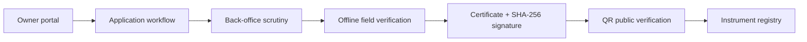

# METRIQ

METRIQ is a Smart India Hackathon 2026 prototype for Problem Statement 26036: an online verification system for weighing and measuring instruments. It is clearly presented as a prototype and does not represent an official Government of India service.

## Run

```bash
npm install
npm run dev
```

Build production assets with `npm run build`.

## Demo accounts

Use **Demo Login** in the header to choose an Instrument Owner, Back Office Officer, Legal Metrology Officer, or System Administrator. The role-aware dashboards are protected in the client prototype.

## Judge flow

1. Open `/demo` for linked checkpoints.
2. Submit an owner application through `/apply`.
3. Switch to Back Office and scrutinize it at `/dashboard/office`.
4. Schedule it at `/dashboard/office/schedule`.
5. Switch to Field Officer, enable offline mode and start the assigned task.
6. Save the field verification locally, complete the verification, and open the generated certificate.
7. Verify the certificate at `/verify/LM-HYD-2026-000184`.
8. In OCR Recognition, change the detected serial to `EWS300-98299` to show the mismatch scenario.

## Architecture



The prototype uses React, TypeScript, Vite, React Router, Lucide icons, Recharts, `qrcode.react`, Web Crypto, a service worker, localStorage, and IndexedDB. IndexedDB stores offline task and verification queue items; the **Sync Now** action clears the queue after simulated registry synchronization.

OCR is designed as a browser-side OCR workflow with Tesseract.js included as a dependency. The presentation demo keeps a deterministic OCR result so it remains reliable without a long language-model download. QR codes are real SVG QR encodings of the public certificate URL.

## Prototype limits

The empty starting repository has been implemented as a durable client-side prototype. A production deployment would add an Express API, JWT and password hashing on the server, PostgreSQL/Prisma migrations, file storage, full Tesseract worker execution, a camera QR scanner, and an authenticated certificate-signing service. No actual government fees, rules, officers, or legal signatures are claimed.
